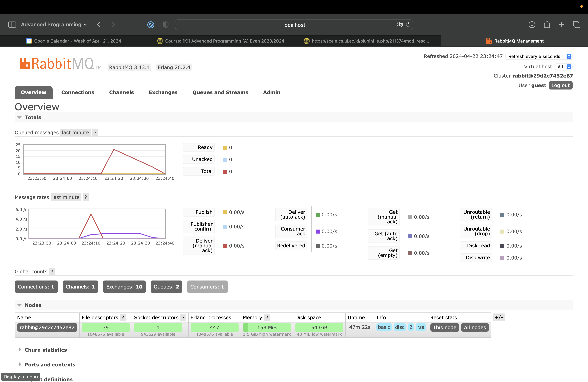

1. What is amqp?
Advanced Message Queuing Protocol (AMQP) is a protocol for facilitating communication between applications or services. In other words, it provides a way for software components to communicate asynchronously. This promotes decoupling and scalability in distributed systems. AMQP has a set of rules that allow messages to be exchanged across different platforms and programming languages. It supports features such as message queuing, routing, and delivery assurance, enabling robust and fault-tolerant messaging architectures.

2. What it means? guest:guest@localhost:5672, what is the first guest, and what is
the second guest, and what is localhost:5672 is for?
The entire string represents the credentials and connection information used to access an AMQP server. The first guest is the username used to authenticate with the AMQP server. The second guest is the password associated with the username used for authentication. guest is a common default username and password used in demo environments. localhost:5672 refers to the hostname and port number, respectively split by the colon, of the AMQP server. In conclusion, guest:guest@localhost:5672 means that the client application is connecting to the local AMQP server using guest as the username and password.

- Simulation slow subscriber

The total number of queues was roughly 21 according to its peak on the graph. Each time cargo run is executed, 5 messages are sent. If cargo run was executed 5 times at same time, there was a total runtime of 25 seconds. Because it was executed sequentially, time was lost and the runtime was cut to 21 seconds. thread::sleep(ten_millis) forces the subscriber program to wait 10ms before receiving any messages. 

- Reflection and Running at least three subscribers

Despite the total number of queue reaching around 32, the spikes reduce at roughly the same rate as before. This is because there are three subscribers to receive messages from the publisher at the same time. This is called multithreading, when multiple threads are used to perform a single process. In this case, it increases the rate at which messages messages can be exchanged between the publisher and subscriber. In the publisher code, we could simulate traffic by increasing the number of messages sent per invocation.